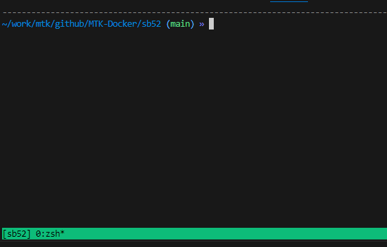

# MTK i500 SB52 Docker Build
This project is to build MTK i500 SB52 in docker container.
## _MTK i500 SB52_
_TODO_: CI/CD icons

## Features

- **build.sh** :  shell script to build MTK SB52 yocto
- **docker_run.sh** : shell script to run container (TODO: replace with compose yaml file)
- **Dockerfile** :  to build docker image for MTK SB52 build environment
- **sb52_env** : MTK SB52 yocto environment parameters which called by build.sh


## Environments (Recommendations)
- **[Linux AI Server]** IP : 140.96.98.144 : create new sudo user for build personal environment
- **[tmux]** for background screen while long time build


## Installation
#### GIT Clone

```sh
git clone git@github.com:R300-AI/MTK-Docker.git
```

#### cp sb52-yocto-3.1.205.tar.xz.zip in MTK-Docker and unzip and untar
```bash
# password: vxeLHLvxHx9k3Knn
$ unzip sb52-yocto-3.1.205.tar.xz.zip
Archive:  sb52-yocto-3.1.205.tar.xz.zip
[sb52-yocto-3.1.205.tar.xz.zip] sb52-yocto-3.1.205.tar.xz password: 
  inflating: sb52-yocto-3.1.205.tar.xz
$ tar -xf sb52-yocto-3.1.205.tar.xz
$ ls
LICENSE  README.md  sb52  sb52-yocto-3.1  sb52-yocto-3.1.205.tar.xz  sb52-yocto-3.1.205.tar.xz.zip
### mv sb52-yocto-3.1 all files into sb52 folder
$ mv sb52-yocto-3.1/* sb52/.
$ rm -rf sb52-yocto-3.1 
$ cd sb52
$ ls
build.sh  Dockerfile  docker_run.sh  gn  meta  prebuilt  README.md  sb52_env  src
```
## Build Sb52 Yocto Docker Images
Skip this step if sb52 docker images exists
```bash
## docker images name is sb52:dev
$ docker build -t sb52:dev . --no-cache
## check sb52:dev has been created
$ docker images
REPOSITORY                TAG       IMAGE ID       CREATED         SIZE
sb52                      dev       6a11b228b175   6 minutes ago   891MB
build_linux               latest    0c8418b0afc8   7 minutes ago   2.13GB
yolo                      latest    d8fce48fdf2a   31 hours ago    12.8GB
ultralytics/ultralytics   latest    d8fce48fdf2a   31 hours ago    12.8GB
ubuntu                    20.04     6df894023726   3 weeks ago     72.8MB
ubuntu                    18.04     f9a80a55f492   2 months ago    63.2MB 
```

## Start to Build SB52 in Container
### 1. create new tmux screen (optional/recommendation)
```bash
$ tmux new -s sb52
```

### 2. create your own container with your username
```bash
### run docker_run.sh script
$ ./docker_run.sh
7837edb4ee772eb1686e18abfd4d984602c61b487ede2ca4cc6b1503c89e6dee
### check container exist
$ docker ps
CONTAINER ID   IMAGE      COMMAND       CREATED          STATUS          PORTS     NAMES
7837edb4ee77   sb52:dev   "/bin/bash"   23 seconds ago   Up 22 seconds             anitawu-sb52
```
### 3. enter your own container
```bash
$ docker exec -it anitawu-sb52 bash
root@7837edb4ee77:/#
```
### 4. start to build sb52 in container
```bash
### 1. switch to dev user
root@7837edb4ee77:/# su dev
### 2. cd to dev home
dev@7837edb4ee77:/$ cd
### 3. cd to sb52-yocto folder
dev@7837edb4ee77:~$ cd sb52-yocto/
### 4. start to build sb52-yocto
```
### 5. exit tmux screen to do other thing with Ctrl+D (optional/recommendation)
```bash
[detached (from session sb52)]
$
```


